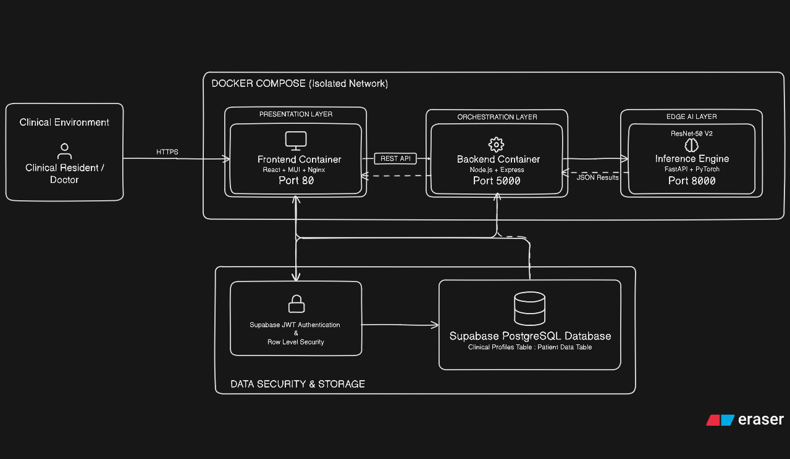

# SightX: Diabetic Retinopathy Detection System

## 🔬 The SightX Story
Diabetes is a global challenge, and Diabetic Retinopathy remains a leading cause of preventable blindness. For many, the first symptom is permanent vision loss. **SightX was built with a personal mission:** to bridge the gap between advanced medical AI and the patients who need it most, honoring a family journey with diabetes.

By combining a **ResNet-50 V2** backbone with Bayesian decision theory and a "No-Line" clinical UI, SightX provides a robust, safe, and beautiful screening experience.

---

## 🏗 System Architecture
SightX is built as a highly-decoupled microservices stack, ensuring scalability and clinical reliability.



| Component | Responsibility | Tech Stack | Documentation |
| :--- | :--- | :--- | :--- |
| **Frontend** | Clinical Interface & User Flow | React, MUI, Vite | [View README](./frontend/README.md) |
| **Backend** | API Orchestration & Gateway | Node.js, Express, Multer | [View README](./backend/README.md) |
| **Inference Engine** | ResNet AI & Clinical Post-processing | PyTorch, FastAPI, NumPy | [View README](./inference-engine/README.md) |

---

## 🌟 Technical Highlights
### 1. Clinical-Grade AI Safety
- **108-Iteration TTA Ensemble**: Robustness against camera artifacts using Test-Time Augmentation.
- **Bayesian Prior Correction**: Adjusts for training-set bias (EyePACS) to reflect real-world clinical prevalence.
- **Risk-Minimized Decisions**: Uses an asymmetric cost matrix to prioritize patient safety over raw accuracy.

### 2. Clinical UI
- **The "No-Line" Rule**: A design philosophy utilizing tonal layering and depth instead of harsh borders.
- **Clinical Aesthetics**: Glassmorphism and high-performance animations tailored for medical environments.

---

## 📋 Prerequisites

Before launching the SightX stack, ensure you have the following installed:

1. **Docker & Docker Compose**: (Required for Orchestration)
   - [Install Docker Desktop](https://www.docker.com/products/docker-desktop/) (includes Compose).
2. **Supabase Account**: (Required for Persistence)
   - [Sign up for free](https://supabase.com/dashboard/sign-up).
3. **Local Dev Tools** (Optional - only if running services individually):
   - **Node.js 18+**: For Frontend and Backend.
   - **Python 3.10+**: For the Inference Engine.

---

## 🚀 Quick Start (Orchestration)
The entire SightX stack is containerized for professional deployment.

1. **Environment Config**: Ensure your `.env` contains the required Supabase and AI engine tokens.
2. **Launch Stack**:
   ```bash
   docker-compose up --build
   ```
3. **Internal Access**:
   - Frontend: `http://localhost:80`
   - Backend API: `http://localhost:5001`
   - Inference Engine: `http://localhost:8000`

## 🔗 Supabase Persistence & Authentication Setup

SightX uses **Supabase** (Postgres + Auth + Row Level Security) to manage practitioner accounts, clinical roles, and diagnostic records. This section walks you through setting up Supabase from scratch so you can fully recreate the authentication and data layer.

### Step 1: Create a Supabase Project

1. Go to [supabase.com/dashboard](https://supabase.com/dashboard/sign-up) and create a free account.
2. Click **New Project**, choose an organization, and give your project a name (e.g., `sightx-dev`).
3. Set a **database password** — save this somewhere safe, but you won't need it for the app.
4. Choose your **region** and click **Create new project**. Wait for provisioning to complete.

### Step 2: Grab Your API Keys

Once your project is live, navigate to **Project Settings → API** in the Supabase dashboard.

You need two values:
| Key | Where to Find It |
| :--- | :--- |
| **Project URL** | `Settings → API → Project URL` |
| **Anon / Public Key** | `Settings → API → Project API Keys → anon public` |

> [!IMPORTANT]
> Use the **anon (public)** key, not the `service_role` key. The anon key is safe to embed in frontend code — RLS policies enforce access control.

### Step 3: Environment Configuration

Create a `.env` file in the **project root**:

```bash
VITE_SUPABASE_URL=https://your-project-id.supabase.co
VITE_SUPABASE_PUBLISHABLE_KEY=your_anon_public_key
```

If running services **outside Docker** (local dev), copy this file into `frontend/`, `backend/`, and `inference-engine/` as well.

### Step 4: Configure Auth Settings

Before creating any users, configure Supabase Auth to work correctly for local development:

1. Go to **Authentication → Providers → Email** in the Supabase dashboard.
2. **Disable "Confirm email"** — this is critical for local dev. If left enabled, every new user will require email verification before they can log in, which blocks the entire flow.
3. (Optional) Under **Authentication → URL Configuration**, set the **Site URL** to `http://localhost:5173` to match your Vite dev server.

> [!WARNING]
> If you skip disabling email confirmation, newly created users will **not be able to log in** until they verify via email. For local development and testing, always disable this.

### Step 5: SQL Foundation (Schema & Trigger)

Open the [Supabase SQL Editor](https://supabase.com/dashboard/project/_/sql) and run the following SQL **in one execution** to create the clinical tables and the auto-profile trigger:

```sql
-- ── 1. Profiles Table (Practitioner Data) ──
create table profiles (
  id uuid references auth.users on delete cascade primary key,
  first_name text,
  last_name text,
  practitioner_id text unique,
  role text check (role in ('resident', 'fellow', 'attending', 'superuser')),
  clinical_unit text,
  created_at timestamptz default now()
);

-- ── 2. Patient Scans Table (Diagnostic Records) ──
create table patient_scans (
  id uuid primary key default gen_random_uuid(),
  patient_name text not null,
  patient_id text not null,
  practitioner_id uuid references auth.users not null,
  clinician_name text,
  ai_diagnosis text,
  final_diagnosis text,
  created_at timestamptz default now()
);

-- ── 3. Auto-Profile Trigger ──
-- Automatically creates a profile row when any new user signs up
create function public.handle_new_user()
returns trigger as $$
begin
  insert into public.profiles (id, first_name, last_name, role)
  values (
    new.id,
    new.raw_user_meta_data->>'first_name',
    new.raw_user_meta_data->>'last_name',
    new.raw_user_meta_data->>'role'
  );
  return new;
end;
$$ language plpgsql security definer;

create trigger on_auth_user_created
  after insert on auth.users
  for each row execute procedure public.handle_new_user();
```

### Step 6: Row Level Security (RLS)

Run this SQL to lock down both tables with proper access policies:

```sql
-- ── Enable RLS ──
alter table profiles enable row level security;
alter table patient_scans enable row level security;

-- ── Profiles Policies ──
-- Users can read their own profile
create policy "Users can view own profile" on profiles
  for select using (auth.uid() = id);

-- Users can update their own profile
create policy "Users can update own profile" on profiles
  for update using (auth.uid() = id);

-- ── Patient Scans Policies ──
-- Authenticated clinicians can read all scans (for institutional visibility)
create policy "Clinicians can view all scans" on patient_scans
  for select using (auth.role() = 'authenticated');

-- Clinicians can only insert scans under their own practitioner ID
create policy "Clinicians can insert own scans" on patient_scans
  for insert with check (auth.uid() = practitioner_id);
```

---

### 🧑‍💼 Step 7: Creating the First Superuser

The **superuser** is the admin account that can register new clinicians through the app. Since no UI exists to self-register (by design), you must create the first superuser manually via the Supabase dashboard.

#### 7a. Create the Auth User

1. In your Supabase dashboard, go to **Authentication → Users**.
2. Click **Add User → Create New User**.
3. Fill in the form:
   - **Email**: e.g., `admin@sightx.local`
   - **Password**: Choose a strong password (minimum 6 characters).
   - **Auto Confirm User**: ✅ Toggle this **ON**.
4. Click **Create User**. Note the `UUID` shown in the user row — you'll need it next.

#### 7b. Insert the Superuser Profile

The auto-trigger won't fire for dashboard-created users (it only fires on `signUp` calls). You need to manually insert the profile row.

Go to the [SQL Editor](https://supabase.com/dashboard/project/_/sql) and run:

```sql
insert into public.profiles (id, first_name, last_name, practitioner_id, role, clinical_unit)
values (
  'PASTE_USER_UUID_HERE',  -- The UUID from the Authentication → Users table
  'Admin',                  -- First name
  'User',                   -- Last name
  'ADMIN-001',              -- A unique practitioner ID
  'superuser',              -- This grants admin privileges
  'Administration'          -- Clinical unit
);
```

> [!TIP]
> Replace `PASTE_USER_UUID_HERE` with the actual UUID from the Supabase Auth users table. You can copy it by clicking on the user row.

#### 7c. Verify the Superuser

1. Start the SightX frontend (`npm run dev` in `frontend/`).
2. Navigate to `/login`.
3. Log in with the email and password you just created.
4. You should be automatically redirected to `/admin/create-user` — the clinician registration page.

---

### 👩‍⚕️ Step 8: Creating Clinician Accounts (Via the App)

Once logged in as a **superuser**, you have access to the **Register Clinician** page at `/admin/create-user`. This is how all additional users are created.

1. Fill in the clinician's details:
   | Field | Description |
   | :--- | :--- |
   | **First Name / Last Name** | The clinician's real name |
   | **Clinician ID** | A unique identifier (e.g., `DR-2024-042`) |
   | **Clinical Unit** | Department (e.g., `Ophthalmology`, `Retina Clinic`) |
   | **User Role** | `Resident`, `Fellow`, or `Attending Physician` |
   | **Login Email** | The email the clinician will use to sign in |
   | **Password** | Their initial login password |

2. Click **Create User & Sign Out**.
3. The system creates the user via `supabase.auth.signUp()`, the trigger automatically populates their `profiles` row, and you are signed out.

> [!NOTE]
> After creating a user, the superuser is **automatically logged out**. This is by design — Supabase's `signUp()` call switches the active session to the newly created user. The logout ensures a clean state.

---

### 🔐 Step 9: Logging In as a Clinician

Regular clinicians (non-superusers) log in through the standard clinical portal:

1. Navigate to `/login`.
2. Enter the email address on Step 1, then click **Continue**.
3. Enter the password on Step 2, then click **Login**.
4. After credential verification (with a scanning animation), you're redirected to `/dashboard` — the Retinal Scan analysis page.

The **Accounts** page (`/dashboard/accounts`) displays:
- Practitioner profile (name, role, clinical unit, practitioner ID)
- Diagnostic statistics (total scans, override rate, urgent cases)
- Full scan session history with filtering and pagination

---

### 🔄 Role Hierarchy & Permissions

| Role | Login Redirect | Can Create Users | Can Run Scans | Can View Own Data |
| :--- | :--- | :---: | :---: | :---: |
| `superuser` | `/admin/create-user` | ✅ | ❌ | ❌ |
| `attending` | `/dashboard` | ❌ | ✅ | ✅ |
| `fellow` | `/dashboard` | ❌ | ✅ | ✅ |
| `resident` | `/dashboard` | ❌ | ✅ | ✅ |

> [!NOTE]
> The `superuser` role is strictly administrative. Superusers are redirected to the user creation page and do not have access to the clinical dashboard. If a person needs both admin and clinical access, create two separate accounts.

---

### 🛠 Troubleshooting

<details>
<summary><strong>I created a user but they can't log in</strong></summary>

- **Check email confirmation**: Go to **Authentication → Providers → Email** and make sure "Confirm email" is **disabled**.
- **Check the user status**: In **Authentication → Users**, verify the user's status shows as "Confirmed" (not "Waiting for verification").
- If a user is stuck, you can manually confirm them by clicking on the user → **Actions → Confirm user**.
</details>

<details>
<summary><strong>User logged in but sees a blank page / gets redirected to "/"</strong></summary>

- The `profiles` row may not have been created. Check the **Table Editor → profiles** table for the user's UUID.
- If missing, the trigger may have failed. Manually insert a row using the SQL from Step 7b.
- If the profile exists but `role` is `null`, update it: `update profiles set role = 'resident' where id = 'USER_UUID';`
</details>

<details>
<summary><strong>Superuser gets redirected away from /admin/create-user</strong></summary>

- Verify their `profiles.role` is exactly `'superuser'` (case-sensitive).
- Check in **Table Editor → profiles** that the row exists and the role value is correct.
</details>

<details>
<summary><strong>"Permission denied" or "Row level security" errors</strong></summary>

- Ensure you ran the full RLS policy SQL from Step 6.
- Verify RLS is **enabled** on both `profiles` and `patient_scans` in **Table Editor → (table) → RLS policies**.
- Check that your `.env` uses the **anon** key, not the `service_role` key.
</details>

<details>
<summary><strong>Auto-profile trigger not working for new signups</strong></summary>

- Verify the trigger exists: In SQL Editor, run `select * from pg_trigger where tgname = 'on_auth_user_created';`
- If empty, re-run the trigger creation SQL from Step 5.
- Note: Users created via the Supabase dashboard **do not** trigger `on_auth_user_created`. Only `supabase.auth.signUp()` calls (from the app) fire this trigger.
</details>

---

### 🧪 Research vs. B2B Deployment
- **Research/Dev**: The [Supabase Free Plan](https://supabase.com/pricing) is sufficient for prototyping and individual trials.
- **Institutional (B2B)**: For hospital-grade, **HIPAA/GDPR** compliant environments, a **B2B/Enterprise Plan** is required to support dedicated database instances and enhanced audit logs.

---

## 🩺 Clinical Operating Mandate

### 1. Optical Hardware Requirements
SightX is optimized for high-resolution retinal imaging. To ensure diagnostic accuracy, images **must** be captured using professional **Digital Fundus Cameras**:
- **Field of View (FOV)**: Minimum 45° horizontal (non-mydriatic preferred).
- **Resolution**: Minimum 30 pixels per degree (ppd).
- **Standards**: Images should ideally be DICOM-compliant with unique patient identifiers at the point of capture.
- **Environment**: Controlled lighting to minimize artifacts and lens flare.

### 2. Governance & Data Sovereignty
SightX is designed for institutional deployment and adheres to strict clinical governance:
- **Environment**: Must operate exclusively within **Hospital/Clinical Environments** under direct supervision of medical authorities.
- **User Roles**: Intended for use by **Verified Clinicians** and **Medical Residents**.
- **Regulatory (HIPAA/GDPR)**: For real-world patient data, SightX requires a **Supabase B2B/Enterprise Plan**.
    - **Isolated Infrastructure**: Each institution must host a separate, sovereign database instance.
    - **Encryption**: Enterprise-grade encryption at rest and in transit is mandatory for HPI (Health Protected Information).

---

> [!IMPORTANT]
> **Clinical Disclaimer**: SightX is currently a research and educational project. It is intended to demonstrate the potential of AI in telemedicine and should not be used as a primary diagnostic tool without clinical validation and institutional approval.

---
**Built with care to serve people**