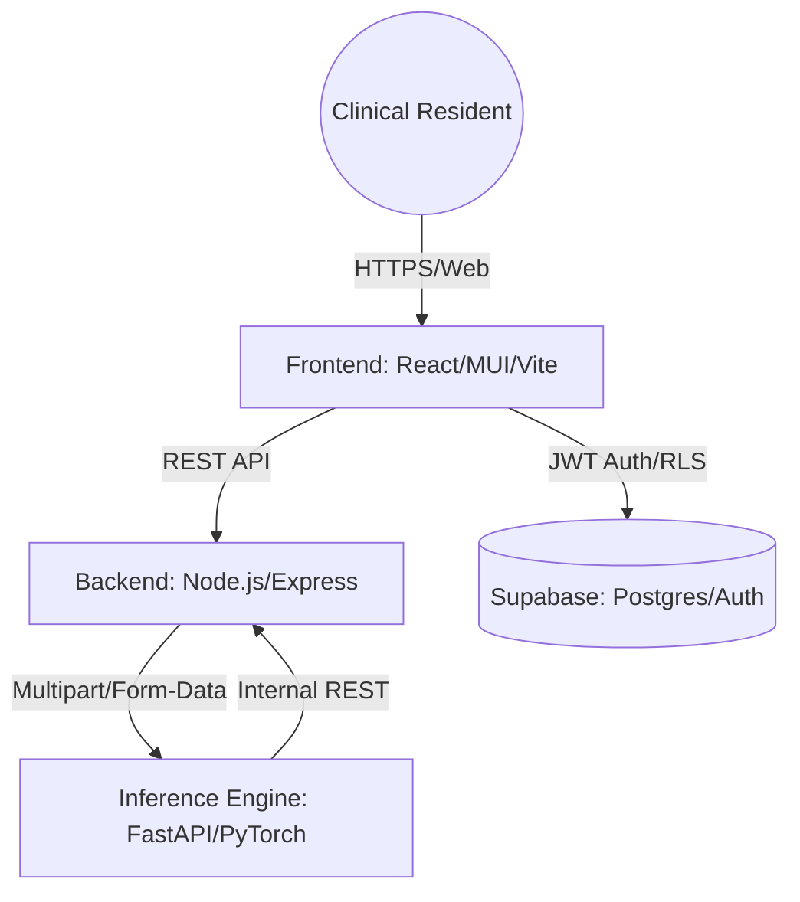
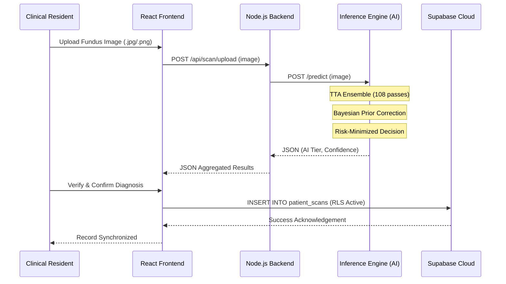
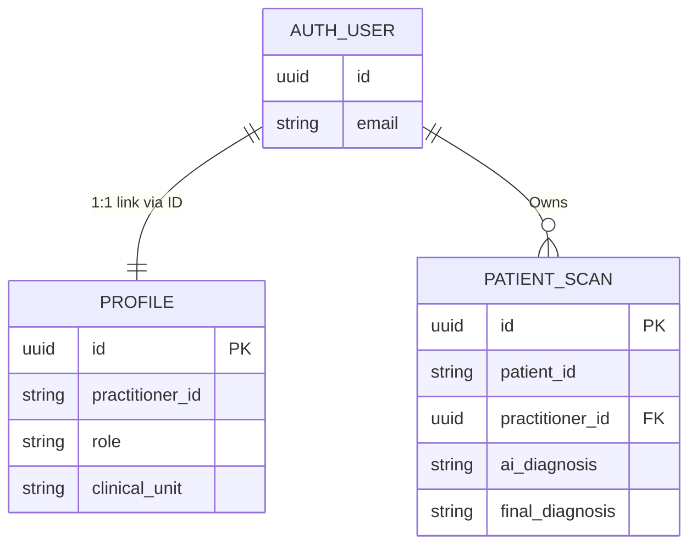

# SightX: Systems Design & Architecture

This document provides a high-level technical overview of the SightX platform, visualizing the orchestration between clinical users, microservices, and AI inference pipelines.

---

## 1. High-Level Architecture
SightX utilizes a decoupled microservices architecture to ensure clinical reliability, scalability, and data sovereignty.

---

## 2. Diagnostic Request Flow
The following sequence diagram illustrates the lifecycle of a single retinal scan, from fundus capture to clinical verification.

---

## 3. Data Model & Sovereignty
SightX maintains strict data isolation through Supabase's relational structure and Row Level Security (RLS).

---

## 4. Service Definitions

### 🛸 Frontend (Presentation Layer)
- **Role**: Handles clinical user flow, auth handshake, and diagnostic visualization.
- **Security**: Supabase Auth (JWT) + RLS Policies.
- **Design**: "No-Line" clinical aesthetic via MUI.

### 🛰 Backend (Orchestration Layer)
- **Role**: Acts as a stateful proxy for the inference engine, managing multipart streams and security logs.
- **Connectivity**: Internal Docker networking (`http://inference-engine:8000`).

### 🧠 Inference Engine (AI Layer)
- **Role**: High-performance ResNet-50 V2 inference.
- **Processing**: Monte-Carlo TTA Ensemble + Bayesian decision theory.

### 🗄 persistence (Data Layer)
- **Role**: HIPAA-ready Postgres storage via Supabase B2B.

---
© 2026 SightX • Systems Design Documentation
