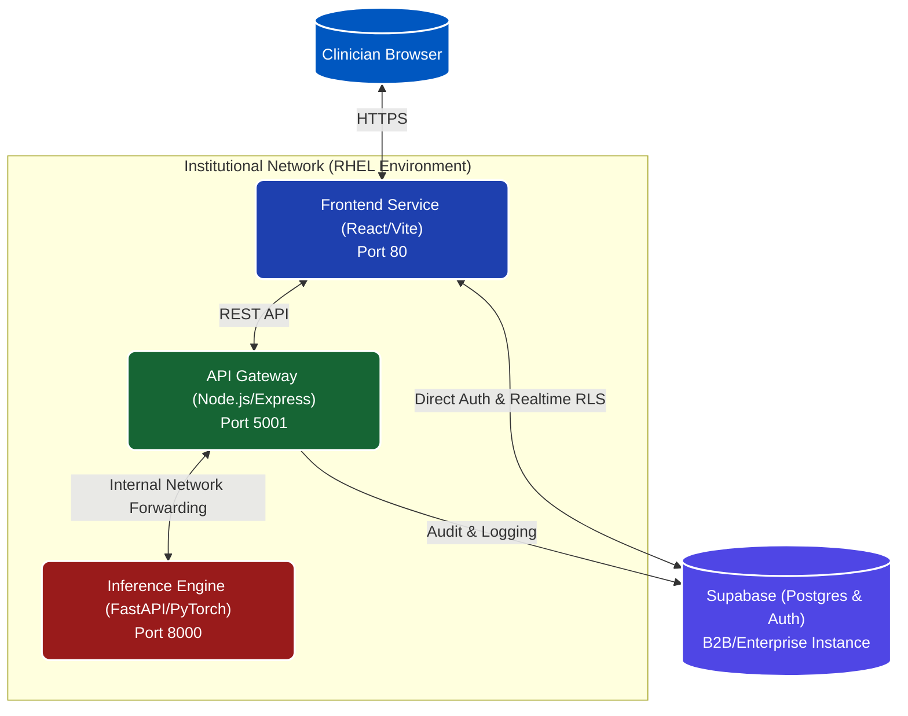
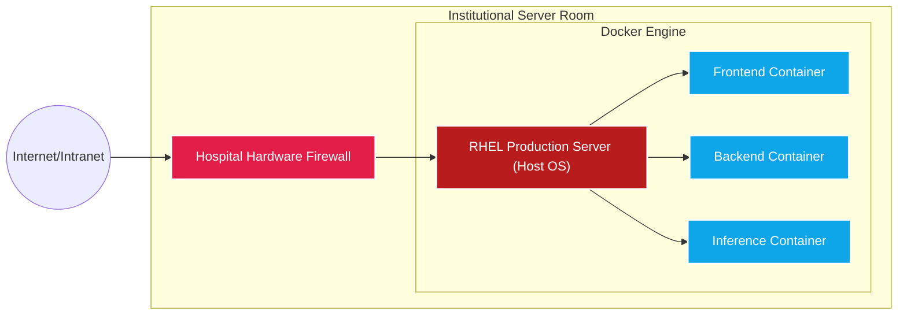

# SightX: System Design & Architecture

This document provides a comprehensive overview of the SightX clinical stack. SightX was architected from the ground up as a decentralized, highly available, and secure microservices ecosystem. 

Notably, this project's deployment model is explicitly designed to **run on institutional Red Hat Enterprise Linux (RHEL) servers**. This mandate ensures strict data ownership, high availability, and compliance with hospital-grade security standards (HIPAA/GDPR).

---

## 1. High-Level Architecture

The system operates across three primary application layers, isolated via Docker networks, communicating upstream to an enterprise database system.

---

## 2. Component Specifications

### 2.1 Frontend Interface (Client Layer)
- **Framework**: React 18, Vite, Material UI (MUI).
- **Responsibility**: Rendering the "No-Line" clinical interface, managing application state, handling local validation, and driving user flow.
- **Security**: The frontend connects directly to Supabase via its anonymous key, constrained strictly by Postgres Row Level Security (RLS) policies. Authentication state is handled locally via JWT.

### 2.2 API Orchestration Layer (Node.js Gateway)
- **Framework**: Node.js, Express, Multer.
- **Responsibility**: Acts as a lightweight proxy and request validator between the frontend and the AI inference engine.
- **Data Handling**: Uses in-memory storage (`multer.memoryStorage()`) to hold retinal scans purely in RAM (ephemeral storage) before forwarding them to the Python engine. No optical data is ever written to disk on the web server, neutralizing a common vector for data leaks.

### 2.3 AI Inference Engine (Deep Learning Layer)
- **Framework**: Python 3.10+, FastAPI, PyTorch.
- **Responsibility**: Receives base64/binary image payloads, applies algorithmic standardization (centering, cropping, normalizing), and executes the 108-Iteration Test-Time Augmentation (TTA) ensemble via a ResNet-50 backbone.
- **Clinical Alignment**: Applies a Bayesian Prior to correct dataset bias against real-world prevalence, and outputs a diagnostic risk matrix. 

### 2.4 Data Persistence & Identity (Supabase)
- **Framework**: Postgres DB, Supabase Auth.
- **Responsibility**: Manages the `profiles` and `patient_scans` schemas. 
- **Security**: Enforces Row-Level Security (RLS) at the database layer. Clinicians act on their own data; Superusers map to custom hierarchical roles protecting sensitive hospital data.

---

## 3. Deployment Architecture: Red Hat Enterprise Linux (RHEL)

SightX is intentionally modeled to skip generic PaaS offerings for production workloads in favor of bare-metal or private-cloud **Red Hat Enterprise Linux (RHEL)** environments. 

### Why RHEL?

1. **Security & SELinux Compliance**: Hospital IT demands strict Mandatory Access Control. RHEL’s native SELinux integration ensures that Docker containers are strictly confined. If an attacker breaches the Node.js API container, SELinux prevents traversing out of the container bounds.
2. **Absolute Data Ownership**: By deploying the orchestration layers via `docker-compose` onto isolated institutional servers, hospitals retain complete sovereignty over diagnostic logs. 
3. **High Availability**: RHEL provides rock-solid uptime guarantees necessary for emergency and clinical environments. Paired with institutional load balancing, the SightX Docker swarm can scale horizontally.

### Deployment Topology

---

## 4. End-to-End Data Flow

The lifecycle of a single clinical scan:

1. **Upload & JWT Auth**: The resident clinician logs into the Vite Frontend (JWT token obtained from Supabase).
2. **Transmission**: The clinician uploads a High-Res Fundus image. The payload is sent via secure REST to the Node.js Backend.
3. **Ephemeral Routing**: The Node.js server receives the image into ephemeral RAM and immediately pipes it to the FastAPI inference engine running on the internal Docker network.
4. **Processing**: PyTorch processes the image. It runs through standard crop/resize logic followed by the ensemble predictor.
5. **Response**: FastAPI returns the Bayesian-adjusted risk severity and feature maps.
6. **Commit**: The Frontend records the AI output alongside the Clinician's final override/diagnosis directly to Supabase (`patient_scans` table), guarded by RLS.
7. **Wipe**: Node.js garbage collects the RAM payload. No trace of the image remains on the host OS.

---
*Documented for SightX Engineering*
